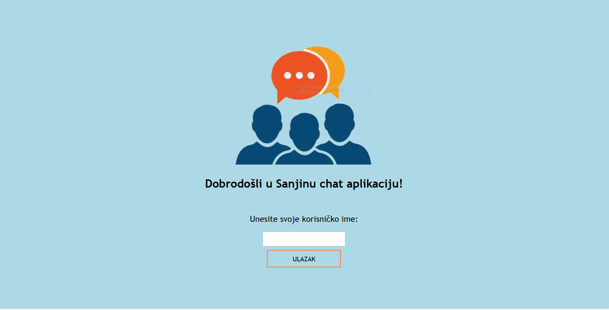
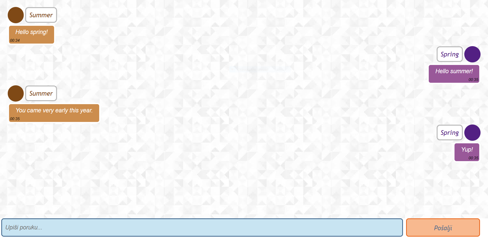

# Chat Application
This chat application is final project for front-end developer course.

**Try it out**: https://sanjasanjuska-chat-app.netlify.app/

## Technologies Used
- HTML
- CSS
- React
- Scaledrone

## Instructions
- npm install
- npm run start
- npm run build

## Features
- enter your name
- preview your name and color
- send messages in real time with timestamp included
- recognizes sender from the rest of the chat members by showing the messages on the right (sender) and on the left (others)
- connected to Scaledrone

## Images of Chat App

